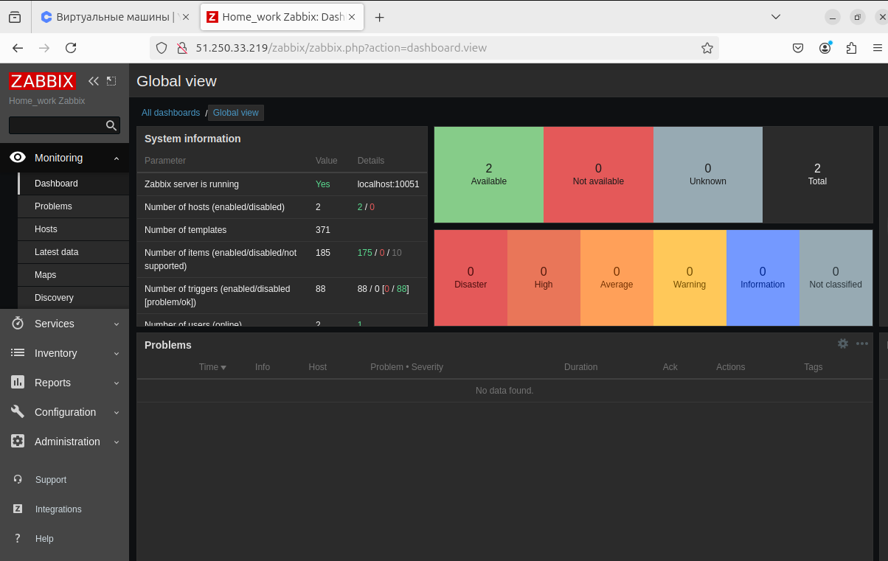
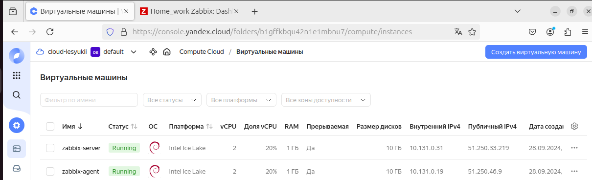
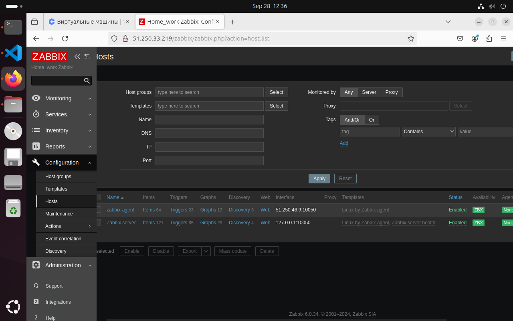

# Домашнее задание к занятию "`Zabbix part 1`" - `Лесюк Иван`


### Инструкция по выполнению домашнего задания

   1. Сделайте `fork` данного репозитория к себе в Github и переименуйте его по названию или номеру занятия, например, https://github.com/имя-вашего-репозитория/git-hw или  https://github.com/имя-вашего-репозитория/7-1-ansible-hw).
   2. Выполните клонирование данного репозитория к себе на ПК с помощью команды `git clone`.
   3. Выполните домашнее задание и заполните у себя локально этот файл README.md:
      - впишите вверху название занятия и вашу фамилию и имя
      - в каждом задании добавьте решение в требуемом виде (текст/код/скриншоты/ссылка)
      - для корректного добавления скриншотов воспользуйтесь [инструкцией "Как вставить скриншот в шаблон с решением](https://github.com/netology-code/sys-pattern-homework/blob/main/screen-instruction.md)
      - при оформлении используйте возможности языка разметки md (коротко об этом можно посмотреть в [инструкции  по MarkDown](https://github.com/netology-code/sys-pattern-homework/blob/main/md-instruction.md))
   4. После завершения работы над домашним заданием сделайте коммит (`git commit -m "comment"`) и отправьте его на Github (`git push origin`);
   5. Для проверки домашнего задания преподавателем в личном кабинете прикрепите и отправьте ссылку на решение в виде md-файла в вашем Github.
   6. Любые вопросы по выполнению заданий спрашивайте в чате учебной группы и/или в разделе “Вопросы по заданию” в личном кабинете.
   
Желаем успехов в выполнении домашнего задания!
   
### Дополнительные материалы, которые могут быть полезны для выполнения задания

1. [Руководство по оформлению Markdown файлов](https://gist.github.com/Jekins/2bf2d0638163f1294637#Code)

---

### Задание 1

1. **Скриншот Zabbix:**

   

2. **Скриншот созданных ВМ:**

   

3. **Установка PostgreSQL:**

    ```bash
    sudo apt install postgresql
    ```

4. **Скачивание и установка репозитория Zabbix:**

    ```bash
    wget https://repo.zabbix.com/zabbix/6.0/debian/pool/main/z/zabbix-release/zabbixrelease_6.0-4%2Bdebian11_all.deb
    dpkg -i zabbix-release_6.0-4+debian11_all.deb
    apt update
    ```

5. **Установка Zabbix сервера и компонентов:**

    ```bash
    sudo apt install zabbix-server-pgsql zabbix-frontend-php php7.4-pgsql zabbix-apache-conf zabbix-sqlscripts nano -y
    ```

6. **Создание пользователя и БД:**

    ```bash
    sudo -u postgres createuser --pwprompt zabbix
    sudo -u postgres createdb -O zabbix zabbix
    ```

7. **Импорт схемы:**

    ```bash
    zcat /usr/share/zabbix-sql-scripts/postgresql/server.sql.gz | sudo -u zabbix psql zabbix
    ```

8. **Добавляем пароль DBPassword:**

    ```bash
    sed -i 's/# DBPassword=/DBPassword=paSS/g' /etc/zabbix/zabbix_server.conf
    ```

9. **Запуск Zabbix server, agent и веб-сервера:**

    ```bash
    sudo systemctl restart zabbix-server apache2 # zabbix-agent
    sudo systemctl enable zabbix-server apache2 # zabbix-agent
    ```


### Задание 2

1. **Раздел Configuration > Hosts:**



2. **Раздел Monitoring > Lates data:**


3. **Установка репозиторий Zabbix:**

    ```bash
    wget https://repo.zabbix.com/zabbix/6.0/debian/pool/main/z/zabbix-release/zabbix-release_6.0-4+debian11_all.deb
    dpkg -i zabbix-release_6.0-4+debian11_all.deb
    apt update
    ``` 

4. **Установка Zabbix агента:**

    ```bash
    apt install zabbix-agent
    ```

5. **Запуск Zabbix агента:**

    ```bash
    systemctl restart zabbix-agent
    systemctl enable zabbix-agent
    ```

6. **Добавление IP адреса Zabbix Server:**
    
    ```bash
    sudo nano /etc/zabbix/zabbix_agentd.conf
    ```